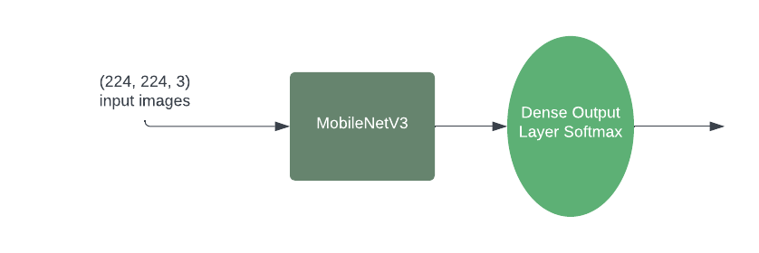
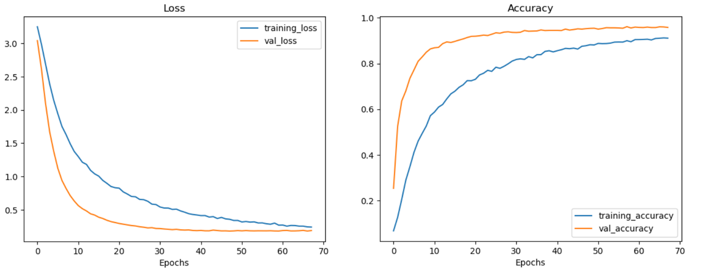
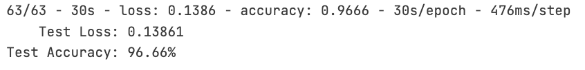
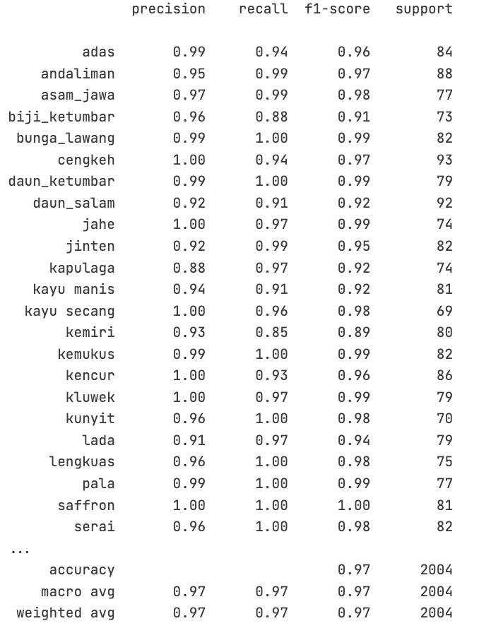

# RempaHustle-Bangkit-Machine-Learning
This repository contains a convolutional neural network and tansfer learning image classification model with 25 labels implemented using two different architectures: InceptionV3 and MobileNetV3. We chose the MobileNetV3 model as the one used in our application, achieving an accuracy of 96% on the test dataset with a model size of 16MB.

## Introduction
Transfer learning is a popular technique in deep learning, where a pre-trained model is utilized as a starting point for a new task. In this repository, we have trained the model using two different achitectures: InceptionV3 and MobileNetV3. After training the models using the two architectures, we meticulously evaluated their performance. The results revealed that InceptionV3 achieved the highest accuracy, with an impressive 97% accuracy on the test dataset with a model size of 264 MB. However, MobileNetV3 achieved 96% accuracy on the test dataset and has a lightweight model size of 16 MB. Therefore, we chose the MobileNetV3 model, which has a 1% difference in accuracy but comes with a lightweight model size, as the model for our application.

## Dataset
We collect images of Indonesian spices and non-spices using web scraping with the bing_image_downloader library, searching on various free platforms, and manually taking photos of the spices. After collecting the data, we prepare the data by cleaning the images that we found not suitable for our model, such as deleting and cropping images that can still be used.

We have a total of 25 classes:

1. adas
2. andaliman
3. asam_jawa
4. biji_ketumbar
5. bunga_lawang
6. cengkeh
7. daun_ketumbar
8. daun_salam
9. jahe
10. jinten
11. kapulaga
12. kayu_manis
13. kayu_secang
14. kemiri
15. kemukus
16. kencur
17. kluwek
18. kunyit
19. lada
20. lengkuas
21. pala
22. saffron
23. serai
24. vanili
25. wijen

### Link to dataset
- [DATASET RempaHustle](../Spices_Clasification_update/)

## Preprocessing Data
We use image augmentation by applying various transformations to the original images to creates additional training samples with different variations. Image augmentation is useful to expanding the training data with diverse variations and to reduce overfitting.

## Create Models
For Mmodel architecture, resize image into 224x224 and we use transfer learning use MobileNetV3. In general, the Architecture of MobileNetV3:

## Evaluate and Test the model
This is ipnyb Our model, train, evaluate dan test:
- [Train and test](classification_spice.ipynb)

RempaHustle model Loss and Accuracy
- 

This is the result after we test the images to classify the spice using the model we created before:

RempaHustle model test Accuracy
- 

RempaHustle f1 score
- 

## Disclaimer
-   This project is created for educational purpose as the requirement to graduate from [**_Bangkit Academy led by Google, Tokopedia, Gojek, & Traveloka_**.](https://www.linkedin.com/company/bangkit-academy/mycompany/)